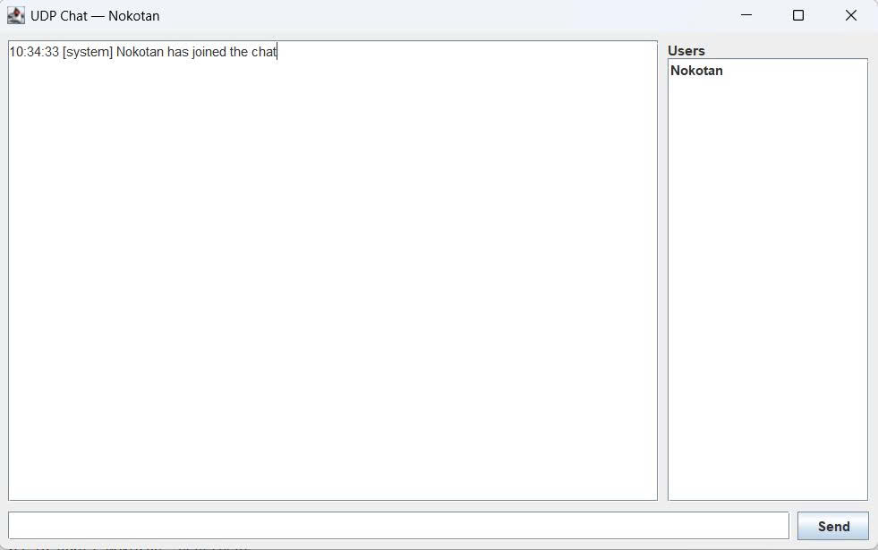
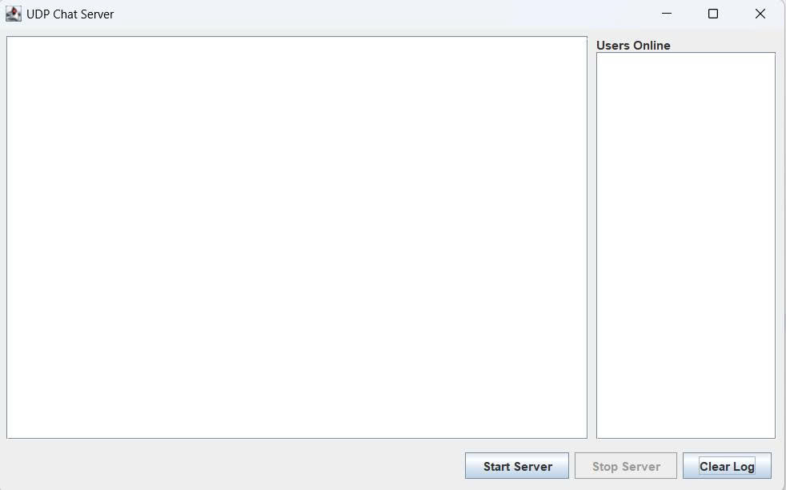

<h2 align="center">
    <a href="https://dainam.edu.vn/vi/khoa-cong-nghe-thong-tin">
    🎓 Faculty of Information Technology (DaiNam University)
    </a>
</h2>
<h2 align="center">
   CHAT ROOM – UDP MULTICAST
</h2>
<div align="center">
    <p align="center">
        
        
        
    </p>

[](https://www.facebook.com/DNUAIoTLab)
[](https://dainam.edu.vn/vi/khoa-cong-nghe-thong-tin)
[](https://dainam.edu.vn)

</div>

---

## 📖 1. Giới thiệu hệ thống 

**Chat Room dùng UDP Multicast** là một ứng dụng lập trình mạng cho phép nhiều người dùng tham gia trò chuyện trong cùng một phòng thông qua địa chỉ multicast.  
Hệ thống được xây dựng nhằm giúp sinh viên hiểu và thực hành:

- Cách sử dụng **UDP Datagram Socket** để truyền/nhận gói tin trong mạng.  
- Cơ chế **Multicast** để truyền thông tin đồng thời tới nhiều client.  
- Triển khai các tính năng chat từ cơ bản đến nâng cao, gần giống một ứng dụng thực tế.  

📌 Ý nghĩa của hệ thống:

- Mô phỏng môi trường trò chuyện nhóm trên mạng LAN/Internet.  
- Giúp sinh viên rèn kỹ năng **thiết kế giao thức ứng dụng tùy chỉnh**.  
- Thực hành tổ chức **gói tin UDP** và xử lý nhiều client đồng thời.  
- Làm nền tảng để phát triển các ứng dụng **chat nâng cao, truyền file, hoặc hệ thống quản lý người dùng phân tán**.  

---

## 🔧 2. Công nghệ sử dụng

[](https://www.oracle.com/java/technologies/javase-downloads.html)  
[](https://docs.oracle.com/javase/tutorial/networking/datagrams/)   
[](https://www.eclipse.org/)  
[](https://netbeans.apache.org/)  

---

## 🚀 3. Chức năng của hệ thống

### ⚡ Chức năng cơ bản
- **Join group** – Tham gia phòng chat (tham gia địa chỉ multicast).  
- **Leave group** – Thoát khỏi phòng chat.  
- **Send message** – Gửi tin nhắn tới tất cả thành viên trong phòng.  
- **Receive message** – Nhận tin nhắn từ phòng.  
- **Hiển thị thông tin tin nhắn** – Gồm: Tên người gửi, thời gian gửi, nội dung.  

### 🌟 Chức năng mở rộng
- **Nickname** – Mỗi người dùng có tên riêng để phân biệt.  
- **Join/Leave notification** – Gửi thông báo khi ai đó vào/ra phòng.  
- **Private message** – Gửi tin nhắn riêng trực tiếp đến một client (dùng Unicast).  
- **Chat log** – Lưu lịch sử chat (trên file hoặc server).  
- **Multimedia message** – Gửi file/hình ảnh bằng cách chia nhỏ gói tin.  
- **Danh sách user online** – Hiển thị những người đang trong phòng.  
- **Trạng thái online/offline** – Người online hiển thị chấm xanh, offline hiển thị chấm xám.  
- **Multiple rooms** – Hỗ trợ nhiều phòng chat, mỗi phòng gắn với một multicast address riêng.  
- **Server hỗ trợ quản lý (tùy chọn)** – Lưu log, quản lý user, phát lại lịch sử chat cho client mới.  

---

## 📂 4. Cấu trúc thư mục (dự kiến)

ChatRoomUDPMulticast/
│── src/
│ ├── udp.client/
│ │ ├── ChatClient.java
│ │ ├── ChatClientGUI.java
│ ├── udp.config/
│ │ └── MulticastConfig.java
│ ├── udp.message/
│ │ ├── Message.java
│ │ └── MessageSerializer.java
│ └── udp.server/
│ └── ChatServer.java

---

## 🖼️ 5. Một số hình ảnh giao diện

💻 Giao diện Client:  
  

🖥️ Giao diện Server (quản lý người dùng và log):  
  

📜 Lịch sử chat được lưu file:  
  

---

## ⚙️ 6. Các bước cài đặt & chạy

🔧 **Bước 1. Chuẩn bị môi trường**
- Cài đặt **JDK 8 hoặc 11**.  
- IDE khuyến nghị: **Eclipse** hoặc **NetBeans**.  

📦 **Bước 2. Tải project**
- Clone repository từ GitHub:  
  ```bash
  git clone https://github.com/username/udp-multicast-chat.git
  cd udp-multicast-chat

---

## 📌 7. Ý nghĩa ứng dụng
- Rèn luyện kỹ năng sử dụng **UDP Multicast Socket**.  
- Hiểu rõ hơn về **lập trình mạng phân tán**.  
- Ứng dụng để phát triển **các hệ thống chat nhóm, game nhiều người chơi, truyền thông điệp trong IoT**.  
- Làm nền tảng mở rộng sang **TCP/HTTP WebSocket** hoặc **chat server phân tán** trong tương lai.  

---

## 👨‍💻 8. Liên hệ (cá nhân)

Contact me:  

📌 **Họ tên:** [Đào Gia Hưng] – CNTT K16-04  
📌 **Khoa:** Công nghệ thông tin – Trường Đại học Đại Nam  
📌 **Email:** [daogiahung222@gmail.com]  
