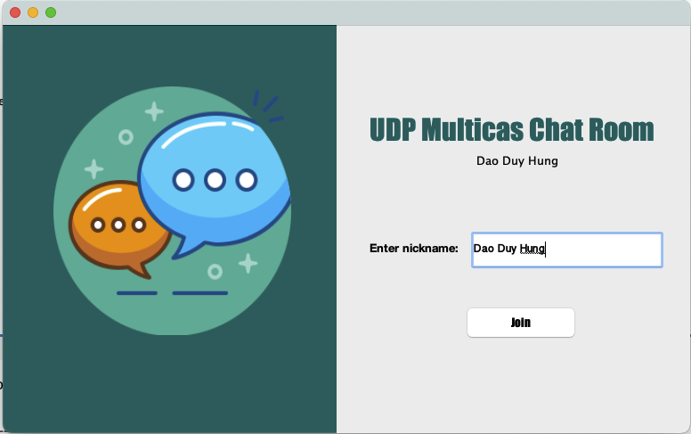
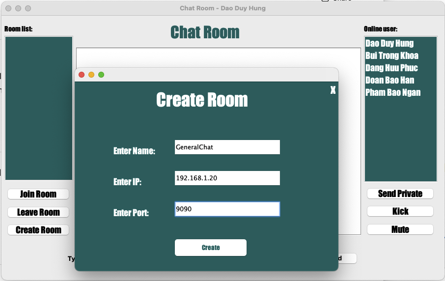

<h2 align="center">
    <a href="https://dainam.edu.vn/vi/khoa-cong-nghe-thong-tin">
    🎓 Faculty of Information Technology (DaiNam University)
    </a>
</h2>
<h2 align="center">
   CHAT ROOM – UDP MULTICAST
</h2>
<div align="center">
    <p align="center">
        
        
        
    </p>

[](https://www.facebook.com/DNUAIoTLab)
[](https://dainam.edu.vn/vi/khoa-cong-nghe-thong-tin)
[](https://dainam.edu.vn)

</div>

---

## 📖 1. Giới thiệu hệ thống
**Chat Room UDP Multicast** là ứng dụng lập trình mạng cho phép nhiều người dùng tham gia trò chuyện nhóm thông qua **UDP Multicast**.  
Ứng dụng này mô phỏng các hệ thống chat thực tế (như **Discord**, **IRC**) nhưng tối ưu băng thông nhờ multicast.  

### 🎯 Mục tiêu:
- Nắm vững kiến thức **UDP Datagram Socket** và **MulticastSocket** trong Java.  
- Thực hành xử lý **multicast group, join/leave, gửi/nhận gói tin**.  
- Quản lý **danh sách user, trạng thái online/offline**.  
- Cơ sở cho ứng dụng **chat nâng cao, IoT broadcast, game multiplayer**.  

---

## 🔧 2. Công nghệ sử dụng
- **Ngôn ngữ**: Java (JDK 8+).  
- **Thư viện chuẩn**: `java.net` (DatagramSocket, MulticastSocket).  
- **Giao diện**: `javax.swing`.  
- **IDE**: Eclipse, NetBeans.  

[](https://www.oracle.com/java/)  
[](https://docs.oracle.com/javase/tutorial/networking/datagrams/)   
[](https://docs.oracle.com/javase/tutorial/uiswing/)  

---

## 🖼️ 3. Hình ảnh giao diện hệ thống

### 💻 Giao diện Login / Join Room
Trang nhập nickname, IP và port để tham gia phòng.  
  

### 🛠️ Giao diện Create Room
Popup tạo phòng mới.  
  

### 🖥️ Giao diện Chat Room
Hiển thị tin nhắn, danh sách phòng, danh sách user online, chức năng quản trị.  
  

---

## ⚙️ 4. Cài đặt & chạy

### 🔧 Bước 1. Chuẩn bị môi trường
- Cài đặt **JDK 8/11**.  
- IDE: **Eclipse** hoặc **NetBeans**.  
- Mạng LAN hỗ trợ multicast.  

### 📦 Bước 2. Clone project
```bash
git clone https://github.com/DaoGiaHung/LTM-1604-D02-Chat-UDP.git
cd udp-multicast-chat
```

### 🛠️ Bước 3. Build & Run
- Mở project trong IDE.  
- Chạy **LoginForm.form** để vào giao diện.  
- Tạo phòng hoặc tham gia phòng có sẵn.  
- Mở nhiều instance client để test.  
- (Tùy chọn) chạy **ServerMain.java**.  

### ⚠️ Lưu ý
- Port mặc định `9090`.  
- Nếu multicast lỗi → kiểm tra firewall/router.  

---

## 👨‍💻 5. Liên hệ
📌 **Họ tên**: Đào Gia Hưng – CNTT K16-04  
📌 **Khoa**: Công nghệ thông tin – Trường Đại học Đại Nam  
📌 **Email**: daogiahung222@gmail.com  

---
