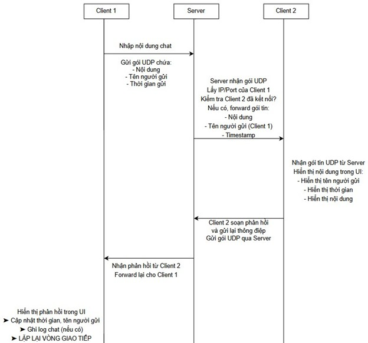

<h2 align="center">
    <a href="https://dainam.edu.vn/vi/khoa-cong-nghe-thong-tin">
    🎓 Faculty of Information Technology (DaiNam University)
    </a>
</h2>
<h2 align="center">
   CHAT ROOM – UDP MULTICAST
</h2>
<div align="center">
    <p align="center">
        
        
        
    </p>

[](https://www.facebook.com/DNUAIoTLab)
[](https://dainam.edu.vn/vi/khoa-cong-nghe-thong-tin)
[](https://dainam.edu.vn)

</div>

---

## 📖 1. Giới thiệu hệ thống
**Chat Room UDP Multicast** là ứng dụng lập trình mạng cho phép nhiều người dùng tham gia trò chuyện nhóm thông qua **UDP Multicast**.  
Ứng dụng này mô phỏng các hệ thống chat thực tế (như **Discord**, **IRC**) nhưng tối ưu băng thông nhờ multicast.  

### 🎯 Mục tiêu:
- Nắm vững kiến thức **UDP Datagram Socket** và **MulticastSocket** trong Java.  
- Thực hành xử lý **multicast group, join/leave, gửi/nhận gói tin**.  
- Quản lý **danh sách user, trạng thái online/offline**.  
- Cơ sở cho ứng dụng **chat nâng cao, IoT broadcast, game multiplayer**.  

---

## 🔧 2. Công nghệ sử dụng
- **Ngôn ngữ**: Java (JDK 8+).  
- **Thư viện chuẩn**: `java.net` (DatagramSocket, MulticastSocket).  
- **Giao diện**: `javax.swing`.  
- **IDE**: Eclipse, NetBeans.  

[](https://www.oracle.com/java/)  
[](https://docs.oracle.com/javase/tutorial/networking/datagrams/)   
[](https://docs.oracle.com/javase/tutorial/uiswing/)  

---

## 🚀 3. Chức năng hệ thống

### ⚡ Chức năng cơ bản
- **Create Room**: Tạo phòng với tên, IP multicast, port.  
- **Join Room**: Tham gia bằng nickname, thông báo tới mọi người.  
- **Leave Room**: Thoát phòng, cập nhật danh sách user online.  
- **Send Message**: Gửi tin nhắn nhóm → tất cả user trong room nhận.  
- **Receive Message**: Hiển thị tin nhắn thời gian thực.  

### 🌟 Chức năng nâng cao
- Nickname riêng biệt cho mỗi user.  
- Thông báo **Join/Leave Notification**.  
- **Private Message** (qua unicast).  
- **Danh sách User Online** (cập nhật động bằng heartbeat).  
- **Trạng thái Online** (danh sách người dùng online).  
- **Multiple Rooms**: nhiều phòng song song.  
- **Quản trị**: Kick/Mute user.  
- **Chat Log**: Lưu lịch sử chat.  
- **Server tùy chọn**: lưu log, quản lý user.  

---

## 🖼️ 4. Giao diện hệ thống

### 💻 Giao diện Login / Join Room
Trang nhập nickname, IP và port để tham gia phòng.  
  

### 🛠️ Giao diện Create Room
Popup tạo phòng mới.  
  

### 🖥️ Giao diện Chat Room
Hiển thị tin nhắn, danh sách phòng, danh sách user online, chức năng quản trị.  
  

---

## 📊 5. Luồng hoạt động hệ thống

### 🔹 Sơ đồ luồng tin nhắn
```
User A ----> Multicast Group ----> User B
           \--> User C
```

- Khi một client gửi tin nhắn → gói UDP được phát qua địa chỉ **multicast IP**.  
- Tất cả client đã **join group** sẽ nhận tin.  

### 🔹 Mô hình Client–Server (tùy chọn)
- **Peer-to-Peer + Multicast** cho chat nhóm.  
- **Unicast** cho private message.  
- **Server** (tùy chọn): lưu log, quản lý user.  

  

---

## 📂 6. Cấu trúc dự án
```
udp-multicast-chat/
│── docs/               # Hình ảnh, sơ đồ, tài liệu
│── src/
│    ├── client/        # Client side (giao diện, socket client)
│    ├── server/        # Server side (nếu dùng)
│    ├── utils/         # Xử lý tiện ích (packet, log, heartbeat)
│    └── resources/     # Icon, cấu hình
│── ChatLog/            # Lưu lịch sử chat (nếu bật)
│── README.md
```

---

## ⚙️ 7. Cài đặt & chạy

### 🔧 Bước 1. Chuẩn bị môi trường
- Cài đặt **JDK 8/11**.  
- IDE: **Eclipse** hoặc **NetBeans**.  
- Mạng LAN hỗ trợ multicast.  

### 📦 Bước 2. Clone project
```bash
git clone https://github.com/DaoGiaHung/LTM-1604-D02-Chat-UDP.git
cd udp-multicast-chat
```

### 🛠️ Bước 3. Build & Run
- Mở project trong IDE.  
- Chạy **LoginForm.form** để vào giao diện.  
- Tạo phòng hoặc tham gia phòng có sẵn.  
- Mở nhiều instance client để test.  
- (Tùy chọn) chạy **ServerMain.java**.  

### ⚠️ Lưu ý
- Port mặc định `9090`.  
- Nếu multicast lỗi → kiểm tra firewall/router.  

---

## 📌 8. Ý nghĩa ứng dụng
- Rèn luyện kỹ năng **lập trình mạng với UDP Multicast**.  
- Hiểu cơ chế **multicast group** và **multithreading** trong Java.  
- Ứng dụng thực tế:  
  - Chat nhóm trong LAN.  
  - Broadcast IoT (gửi lệnh tới nhiều thiết bị).  
  - Game multiplayer (low-latency).  
- Có thể nâng cấp:  
  - **Mã hóa tin nhắn** (AES, RSA).  
  - **TCP/WebSocket** cho truyền file ổn định.  
  - **Web-based Chat** tích hợp trình duyệt.  

---

## 👨‍💻 9. Liên hệ
📌 **Họ tên**: Đào Gia Hưng – CNTT K16-04  
📌 **Khoa**: Công nghệ thông tin – Trường Đại học Đại Nam  
📌 **Email**: daogiahung222@gmail.com  

---
